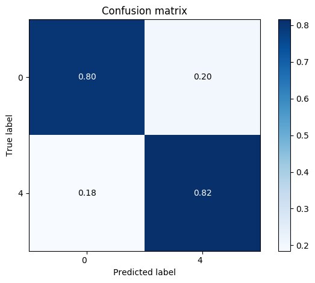

# Answers

## Francisco Gonzalez

### 1.
The approach taken in this problem is to construct a bidirectional RNN with a soft attention mechanism. To make the model converge faster I used a pre-trained [GloVe word embedding](https://nlp.stanford.edu/projects/glove/). The model is constructed as a custom estimator using the TensorFlow [tf.estimator API](https://www.tensorflow.org/api_docs/python/tf/estimator/Estimator). The major package dependencies are listed below
  * python 3.6.5
  * tensorflow 1.12
  * keras 2.2.4
  * nltk 3.4
  * scikit-learn 0.20.3

To train the model and evaluate on the test and inference sets just run

```bash
python -m src.main
```

To analyze the results once the model is done training and has saved the predictions run

```bash
cd src/utils; python eval_results.py
```

### 2.
The dataset was split into a train and test set using a 75%-25% split. The results reported below are on the test set.

- Confusion matrix



- Recall and F1 scores at [70, 75, 80, 85, 90, 95]% precision

| Precision     | Recall        |  F1   |
| :-----------: |:-------------:| :----:|
| 0.70	        | 0.928	        | 0.798 |
| 0.75	        | 0.883         | 0.811 |
| 0.80	        | 0.821	        | 0.810 |
| 0.85	        | 0.732	        | 0.786 |
| 0.90	        | 0.602	        | 0.722 |
| 0.95	        | 0.385	        | 0.548 |


### 3.

The average sentiment for all calls is 3.078


### 4.

The user with the most negative sentiment is bob558. Below is the list of the users with the lowest 5 average sentiment

| User   | Avg. Sentiment|
| :----: |:-------------:|
|bob588  | 1.472         |
|bob332  | 1.519         |
|bob474  | 1.562         |
|bob830  | 1.626         |
|bob371  | 1.650         |
